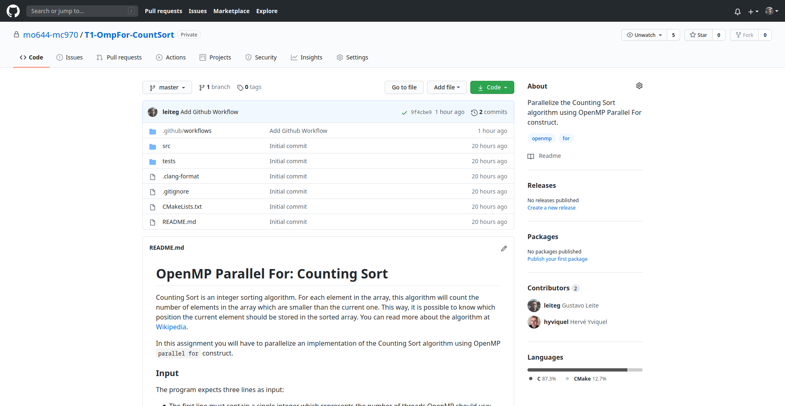
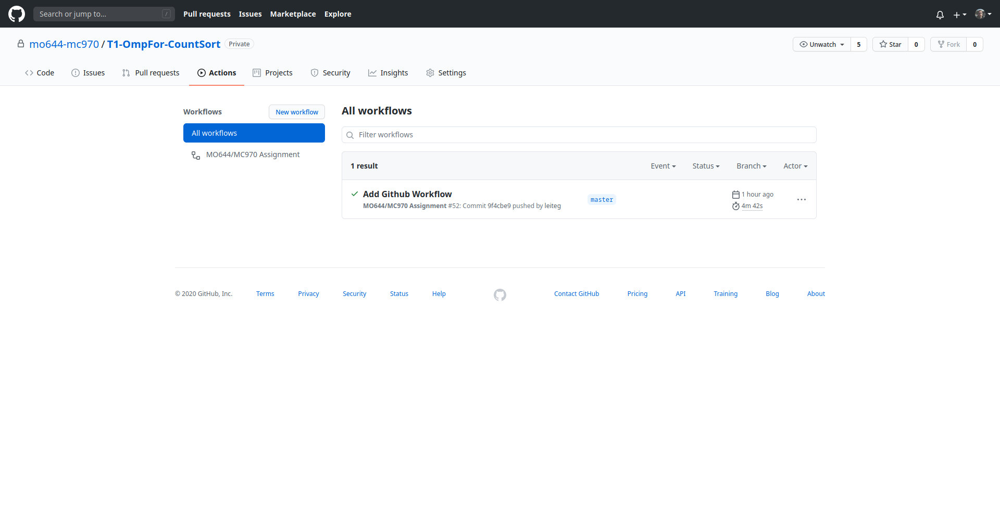
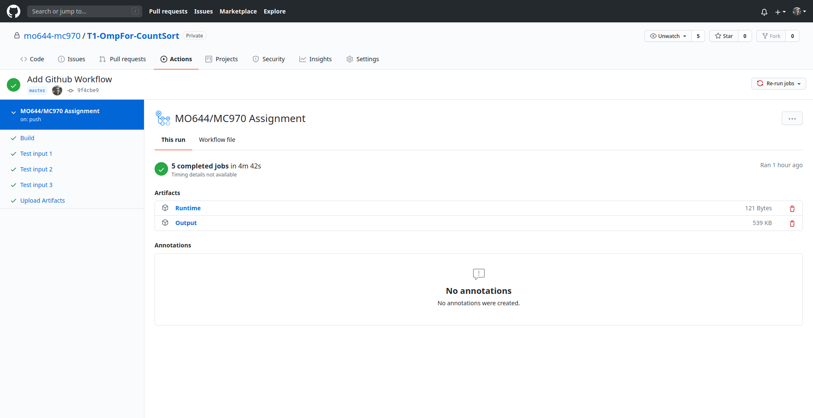
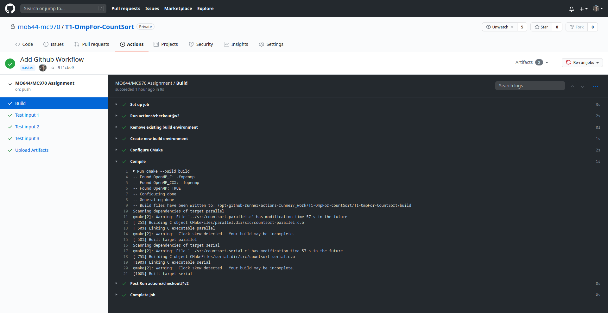
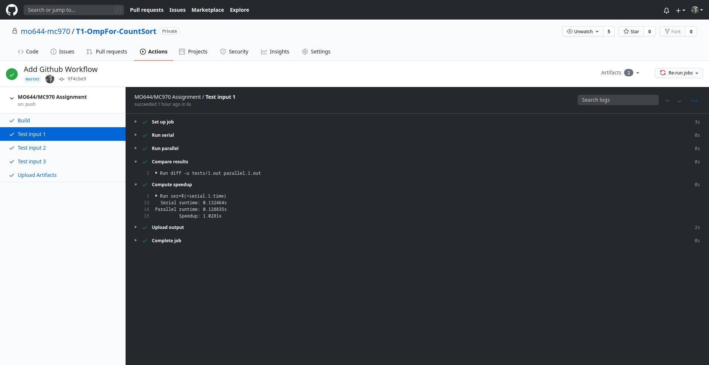

GitHub Actions
================================================================================

In this course, the students will be assigned one programming task every week,
which should be delivered via GitHub Classroom. The students can evaluate their
solutions on their own machines or take advantage of the GitHub Actions
infrastructure. With GitHub Actions, whenever the student pushes commits back to
their repositories an automated routine will be triggered, which will download
the student's repository, build it, and test it. By looking at the Action logs,
it is possible to determine the program output, runtime and speedup.

**Important:** The GitHub Actions infrastructure exists solely for the
convenience of the students, but it will not be used for grading the
assignments. The actual grading will be done using an automated solution
available only to the instructors and TAs in order to prevent cheating.

How to use it
--------------------------------------------------------------------------------

In your repository, click the "Actions" tab at the top bar.

This page lists all the workflow runs. Notice on the left panel the "MO644/MC970
Assignments" workflow. On the center panel you can observe the runs (only one in
this case). Some useful informations are shown for each run: commit hash, who
pushed it, to which branch, etc. Every time you you push commits to your repo, a
new run will automatically start.

If you click in some of the runs, you will be greeted with the following page.
We know this run succeeded because of the green check mark on the top. This
means that every job was completed successfully. You can observe the jobs in the
left panel, for example: Build, Test input 1, Test input 2, Upload Artifacts,
etc. On the main panel you can see an "Artifacts" section where you can download
the output of your program and a CSV file with your program's runtime and
speedup.

If you select the "Build" job, you can read the log for each step. If, for
example, your code has a syntax error, you would see a red cross mark on the
"Compile" step. Click on the step to read its output.

Finally, if you select one of the "Test" jobs, you can see a several steps being
executed: run serial; run parallel; compare results; and compute speedup. Their
names are self-explanatory and you can expand each step to see their outputs.
Both the GitHub Actions infrastructure and the secret grading script require the
output of your program to be exactly like the original version, otherwise the
"Compare Results" step will fail and you will **not** receive a grade.

If you have any further questions, you can contact one of the TAs via email or
Google Classroom.
